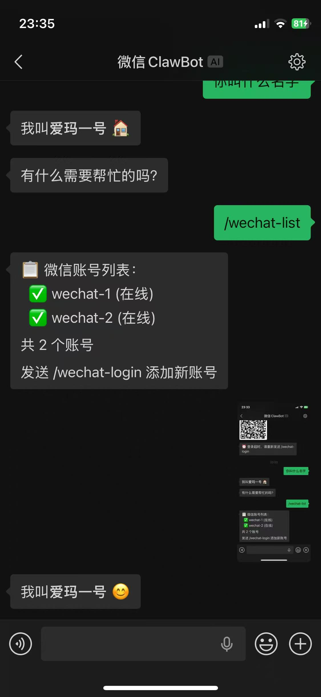
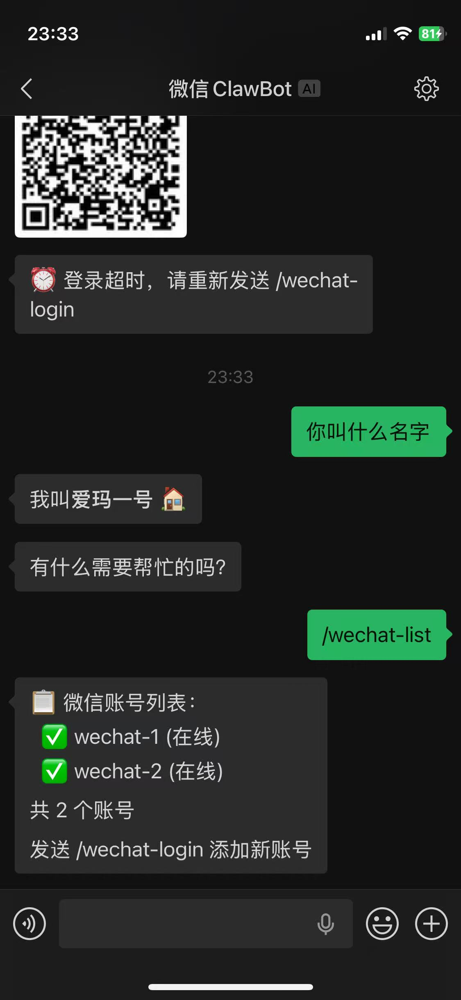
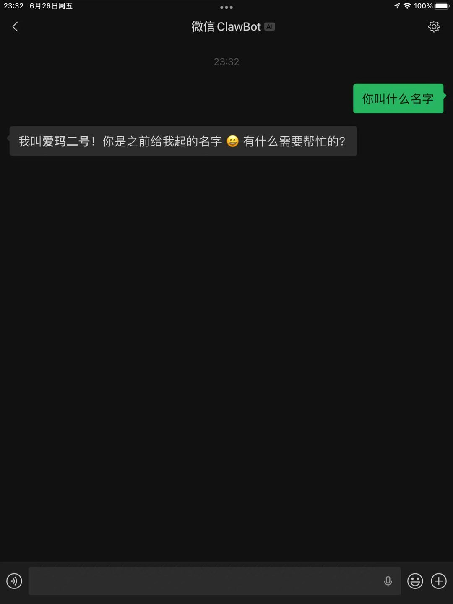

<div align="center">
  <h1>🤖 Hermes Weixin Multi</h1>
  <p><strong>多账号微信接入插件 · Multi-Account WeChat Plugin for Hermes Agent</strong></p>
  <p>基于腾讯 iLink Bot API，让你的 Hermes Agent 同时接入 <b>无限个微信账号</b>。</p>
</div>

<p align="center">
  
  
  
</p>

---

## ✨ 特性

| 功能 | 官方 `weixin` | 本插件 `weixin_multi` |
|------|:------------:|:-------------------:|
| 多账号支持 | ❌ 单账号 | ✅ 无限账号，动态添加 |
| QR 扫码登录 | ❌ CLI 本地 | ✅ 任何渠道（微信/Telegram/WebUI/CLI） |
| 扫码自动重试 | ❌ 过期需重发 | ✅ 自动刷新 3 次 |
| 全局命令 | ❌ | ✅ `/wechat-login`、`/wechat-list` |
| 消息收发 | 基础文本 | ✅ 文本/图片/视频/文件/语音 |
| 错误反馈 | 静默失败 | ✅ 超时/限流提示 |
| WebUI 状态 | ❌ | ✅ 账号在线状态 |
| 独立轮询 | ❌ 单线程 | ✅ 每账号独立线程 |

---

## 📦 安装

### 前置条件

- 已安装 [Hermes Agent](https://hermes-agent.nousresearch.com)
- Python 依赖：`aiohttp`、`cryptography`、`qrcode[pil]`

```bash
pip install aiohttp cryptography qrcode[pil]
```

### 1. 克隆插件

```bash
git clone https://github.com/hyonex/hermes-weixin-multi.git ~/.hermes/plugins/weixin-multi
```

### 2. 启用插件

在 `~/.hermes/config.yaml` 中添加：

```yaml
plugins:
  enabled:
    - weixin-multi

gateway:
  platforms:
    weixin_multi:
      enabled: true
      extra:
        dm_policy: open     # 私聊策略: open / allowlist / disabled
        group_policy: disabled  # 群聊策略
```

### 3. 重启 Gateway

```bash
hermes gateway restart
```

---

## 🚀 使用方法

### 添加微信账号

在任何已绑定的渠道发送：

```
/wechat-login
```

插件会生成二维码，用微信扫码并确认即可自动添加。

### 查看账号列表

```
/wechat-list
```

示例输出：
```
📱 Weixin Multi 账号列表：
  ✅ wechat-1 — 🟢 轮询中
  ✅ wechat-2 — 🟢 轮询中

共 2 个账号
发送 /wechat-login 添加新账号
```

### 删除账号

```bash
rm ~/.hermes/weixin/accounts/wechat-N.json
hermes gateway restart
```

---

## 🏗️ 多账号架构

```
Gateway (单进程)
├── wechat-1 → iLink Bot API → 📱 微信号 A
├── wechat-2 → iLink Bot API → 📱 微信号 B
└── wechat-N → iLink Bot API → 📱 微信号 N
```

每个账号**完全独立**：
- ✅ 独立 iLink token
- ✅ 独立异步轮询线程
- ✅ 独立消息收发
- ✅ 独立会话管理（session）

---

## ⚙️ 配置参考

### 账号文件

存储位置：`~/.hermes/weixin/accounts/wechat-N.json`

```json
{
  "token": "xxx@im.bot:yyy",
  "base_url": "https://ilinkai.weixin.qq.com",
  "cdn_base_url": "https://cdn2.weixin.qq.com"
}
```

### 环境变量（可选）

| 变量 | 说明 | 默认值 |
|------|------|--------|
| `WEIXIN_MULTI_DM_POLICY` | 私聊策略 | `open` |
| `WEIXIN_MULTI_ALLOWED_USERS` | 允许的用户 ID（逗号分隔） | — |
| `WEIXIN_MULTI_BASE_URL` | API 地址 | `https://ilinkai.weixin.qq.com` |

---

## ❓ 常见问题

### QR 码过期

有效期约 5 分钟。插件会自动刷新最多 3 次，超时后重新发 `/wechat-login`。

### Token 过期

iLink token 有时效性，过期后轮询会静默失败（errcode=-14）。重新扫码即可。

### 消息发送失败

检查日志：
```bash
journalctl --user -u hermes-gateway --since "5 min ago"
```

常见原因：
- Token 过期 → 重新扫码
- 模型限流 429 → 等待或切换模型
- 网络问题 → 检查代理配置

---

## 🧑‍💻 开发

### 代码结构

```
hermes-weixin-multi/
├── adapter.py       # 插件适配器（注册、命令、状态）
├── weixin.py        # 核心逻辑（消息收发、媒体处理）
├── plugin.yaml      # 插件元数据
├── screenshots/     # 功能截图
└── README.md        # 本文件
```

### 修改后同步

```bash
cp adapter.py weixin.py ~/.hermes/plugins/weixin-multi/
find ~/.hermes/plugins/weixin-multi/ -name "*.pyc" -delete
hermes gateway restart
```

---

## 📄 许可证

本项目基于 [Hermes Agent](https://github.com/nousresearch/hermes-agent) 的 weixin.py 修改而来。

**原项目：** MIT License © 2025 Nous Research  
**本修改版：** GNU Affero General Public License v3.0 (AGPL-3.0)

- ✅ 个人学习、研究、非营利组织可自由使用
- ✅ 修改后的代码**必须开源**（AGPL 要求）
- ✅ 引用或再分发需注明来源
- ❌ 商业使用需谨慎（AGPL 具有传染性，详见许可协议）

详见 [LICENSE](LICENSE) 文件。

---

<div align="center">
  <p>Made with ❤️ by <a href="https://github.com/hyonex">hyonex</a></p>
  <p>
    <a href="https://github.com/hyonex/hermes-weixin-multi">GitHub</a> ·
    <a href="https://gitee.com/hyonex/hermes-weixin-multi">Gitee</a>
  </p>
</div>
